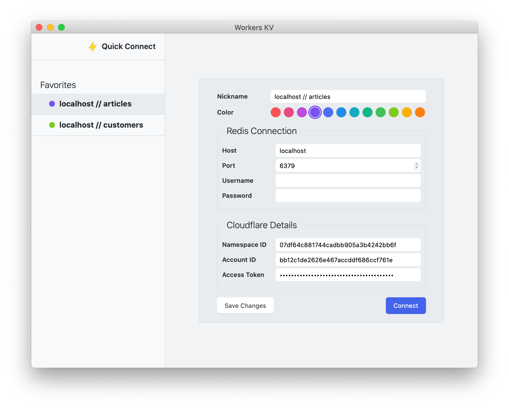
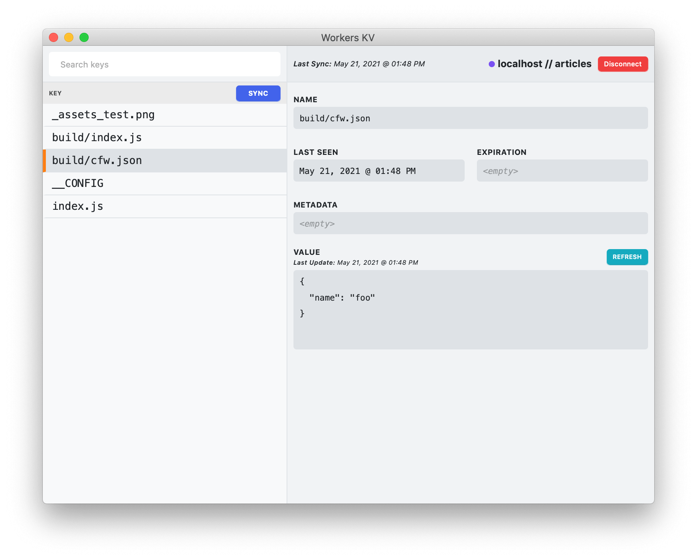

# Workers KV – Desktop GUI

> A cross-platform Desktop application for exploring Workers KV Namespace data

Built with:

* [Svelte](https://svelte.dev) – UI framework
* [Svelte Kit](https://kit.svelte.dev) – UI build system
* [Tauri](https://tauri.studio) – Desktop Application framework
* [Redis](https://redis.io/) – The backing database / cache

## Install

> **Note:** Pre-built images are not available at this time.

You must have [Redis installed locally](https://redis.io/download) to use `localhost` servers.

```sh
$ npm install
$ npm run build
```

## Screenshots

***Setup or Manage Connections***



***Viewing Namespace Keys***


